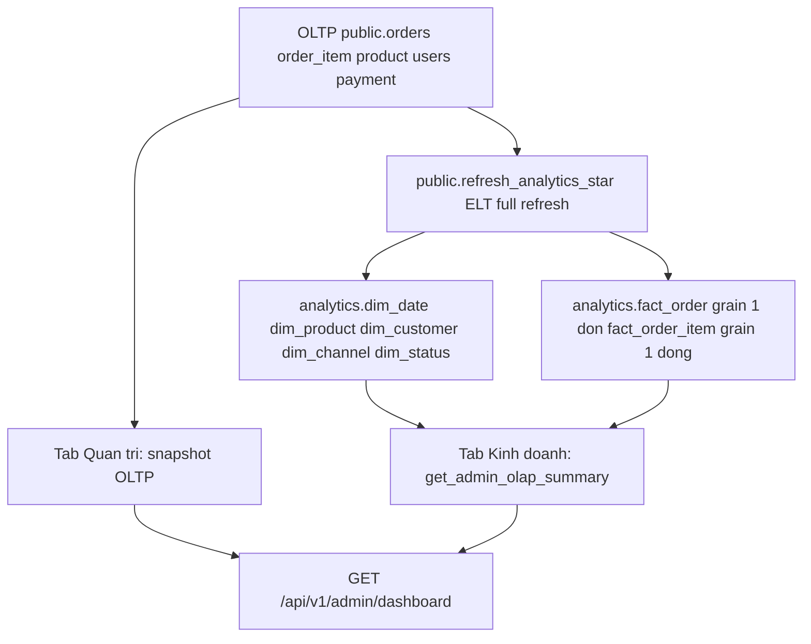
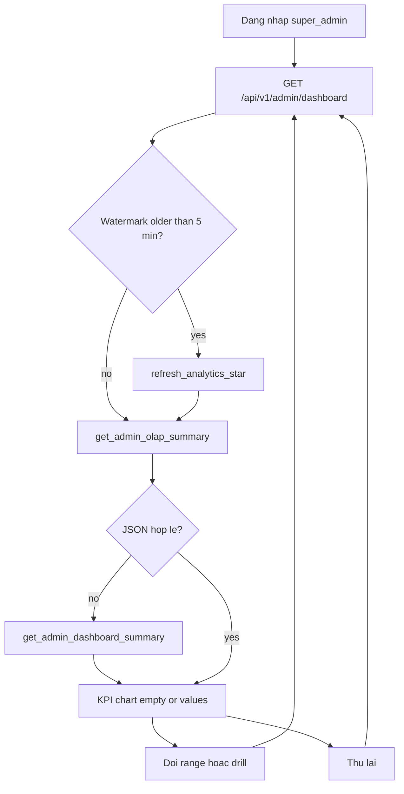

# Admin dashboard OLAP

Trace: `git log --oneline --show-notes --grep=KAN-5 -- apps/api/src/dashboard.ts database/migrations/022_admin_dashboard_olap_star.sql`

Dashboard quản trị tách **vận hành realtime (OLTP)** và **kinh doanh (star Dim/Fact)**. Không dùng kho tách, Spark, hay Airflow.

## Architecture

`GET /api/admin/dashboard` vẫn alias. Angular gọi `/api/v1/admin/dashboard`. Nếu star chưa migrate, API fallback `get_admin_dashboard_summary`.

## KPI and dimensions

| KPI | Grain / công thức | Nguồn |
|---|---|---|
| Doanh thu | SUM(fact_order.revenue) where is_valid | star |
| Số đơn | COUNT(*) fact_order trong kỳ | star |
| Khách hàng | COUNT DISTINCT customer_key, is_valid | star |
| AOV | doanh thu / đơn hợp lệ | star |
| Tỷ lệ hoàn tất | completed\|delivered / tổng đơn | star |
| Tồn kho thấp | COUNT DISTINCT product stock <= threshold | OLTP snapshot |
| Pending / payment error / returns / tickets | snapshot hiện tại | OLTP |

Chiều lọc: thời gian **chỉ ngày / tuần / tháng** (TZ Asia/Ho_Chi_Minh). Không có khoảng tùy chọn. `categoryId`, `productId` vẫn drill trong kỳ đang chọn.

Trang `/dashboard` chỉ `super_admin` và `admin_viewer`. Operator vào dashboard phân hệ (`GET /api/v1/admin/insights?scope=`). Tab Kinh doanh trả lời: DT/DS kỳ này nói gì; KH phản ứng mặt hàng thế nào; KH đánh giá CSKH thế nào; client im lặng thì chặn hoạch định.

## Data dictionary (star)

| Object | PK | Meaning |
|---|---|---|
| dim_date | date_key YYYYMMDD | Lịch VN |
| dim_product | product_key | SKU, category |
| dim_customer | customer_key | Buyer |
| dim_channel | channel_key | payment_method\|ai_source |
| dim_status | status_key | order status |
| fact_order | order_id | 1 đơn, revenue = total_amount |
| fact_order_item | item_id | 1 dòng, revenue = subtotal_item |
| etl_watermark | pipeline_name | last refresh |

Additive: revenue, quantity, discount. Non-additive: AOV, completion rate (tính sau GROUP BY).

## FRD (ADM-DASH-01 / 02)

1. Super admin mở `/dashboard`, KPI tải từ API versioned, không 404.
2. Đổi Ngày / Tuần / Tháng → DT/DS, VoC và insight đổi. Không có custom date.
3. API lỗi: banner + Thử lại; kỳ trống: “Không có dữ liệu trong kỳ”.
4. Mobile ≤768: hamburger mở off-canvas; pager list căn giữa, không lệch phải.
5. Operator không mở được `/dashboard`; mỗi module có insight board riêng.

## BPMN

## Apply migration

Chạy `database/migrations/022_admin_dashboard_olap_star.sql` trên Supabase (service role) trước khi kỳ vọng `meta.source = analytics.star`.
